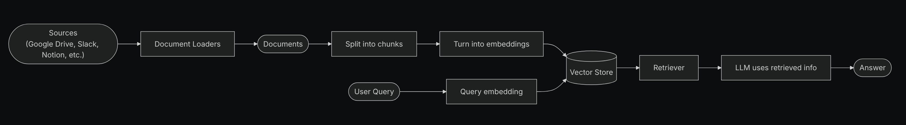
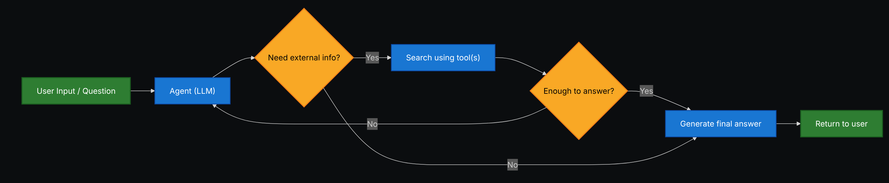

# Retrieval

Большинство современных LLM обладают двумя ключевыми ограничениями:

- **Ограниченный контекст** — они не могут загружать целые корпуса данных за один раз.
- **Статичные знания** — их обучающие данные зафиксированы на определённый момент времени.

**Retrieval-Augmented Generation (RAG)** — это подход, при котором ответы LLM дополняются контекстно-специфичной информацией.

Retrieval позволяет LLM использовать внешние данные (документы, базы знаний, API и т. д.), оставаясь при этом генеративными системами. Вместо того чтобы заранее кодировать всё знание в параметры модели, Retrieval делает возможным:

- Обновляемое знание: добавление новых документов без переобучения модели.
- Персонализированные ответы: использование пользовательских данных или данных организации.
- Устойчивость: уменьшение галлюцинаций за счёт привязки ответов к источникам.

# Построение базы знаний

**Knowledge base** — это хранилище документов или структурированных данных, используемых во время Retrieval. Если вам нужна кастомная knowledge base, вы можете использовать document loaders и vector stores из LangChain, чтобы построить её на основе ваших собственных данных.

Смотрите следующий учебник, чтобы построить поисковую knowledge base и минимальный RAG‑workflow:

- [Tutorial: Semantic search](#tutorial-semantic-search)

Если у вас уже есть существующая knowledge base (например, SQL‑база данных, CRM или внутренняя система документации), вам **не** нужно её перестраивать. Вы можете:

- Подключить её как **tool** для агента в Agentic RAG.
- Делать к ней запросы и передавать полученный контент как контекст в LLM (2-Step RAG).

# Tutorial: Semantic search

В этом разделе вы узнаете, как создать поисковую knowledge base на основе ваших собственных данных с использованием document loaders, embeddings и vector stores из LangChain. В этом tutorial вы построите поисковый движок по PDF‑файлу, что позволит извлекать фрагменты, релевантные запросу. Затем вы реализуете минимальный RAG‑workflow поверх этого движка, чтобы увидеть, как внешние знания могут быть интегрированы в рассуждения LLM.

## От Retrieval к RAG

Retrieval позволяет LLM получать релевантный контекст во время выполнения запроса. Но большинство реальных приложений идут на шаг дальше: они **интегрируют Retrieval с Generation**, чтобы производить обоснованные, контекстно‑зависимые ответы. Это и есть основная идея **Retrieval-Augmented Generation (RAG)**. Retrieval‑pipeline становится фундаментом для более широкой системы, которая комбинирует поиск с генерацией.

## Retrieval Pipeline

Типичный Retrieval‑workflow выглядит так:

1. Загрузка данных: использование document loaders для извлечения данных из внешних источников (файлы, базы данных, API и т. д.).
2. Предобработка текста: разбиение документов на меньшие фрагменты с помощью text splitters.
3. Кодирование: преобразование текстовых фрагментов в embeddings с помощью embedding models.
4. Индексация: сохранение embeddings во vector store.
5. Retrieval: по неструктурированному запросу пользователь получает релевантные документы через retriever.
6. Построение ответа: LLM использует Retrieved документы как контекст для генерации ответа.



Каждый компонент модульный: вы можете заменять loaders, splitters, embeddings или vector stores без переписывания логики приложения.

## Базовые блоки

### Document loaders

Document loaders загружают данные из внешних источников (Google Drive, Slack, Notion и т. д.), возвращая стандартизированные объекты `Document`.

### Text splitters

Text splitters разбивают крупные документы на меньшие фрагменты, которые затем могут извлекаться по отдельности и помещаться в context window модели.

### Embedding models

Embedding model преобразует текст в вектор чисел, чтобы тексты с похожим смыслом располагались близко друг к другу в этом vector space.

### Vector stores

Vector stores — это специализированные базы данных для хранения и поиска embeddings.

### Retrievers

Retriever — это интерфейс, который возвращает документы по неструктурированному запросу.

# RAG Architectures

RAG можно реализовать несколькими способами, в зависимости от потребностей вашей системы. Основные типы описаны в следующих разделах.

| Architecture | Description                                                                    | Control   | Flexibility | Latency     | Example Use Case                                 |
| ------------ | ------------------------------------------------------------------------------ | --------- | ----------- | ----------- | ------------------------------------------------ |
| 2-Step RAG   | Retrieval всегда происходит до Generation. Простой и предсказуемый подход.     | ✅ High   | ❌ Low      | ⚡ Fast     | FAQs, документационные боты                      |
| Agentic RAG  | Агент на базе LLM решает, когда и как делать Retrieval в процессе рассуждения. | ❌ Low    | ✅ High     | ⏳ Variable | Research‑ассистенты с доступом к множеству tools |
| Hybrid       | Комбинирует характеристики обоих подходов с этапами валидации.                 | ⚖️ Medium | ⚖️ Medium   | ⏳ Variable | Domain‑specific Q&A с проверкой качества         |

**Latency**: задержка в общем случае более **предсказуема** в **2-Step RAG**, поскольку максимальное количество вызовов LLM известно и ограничено. Это предположение справедливо, если основную долю времени занимает LLM‑inference. Однако реальная latency также может зависеть от производительности Retrieval‑шагов — таких как время ответа API, сетевые задержки или запросы к базе данных, — которые варьируются в зависимости от используемых tools и инфраструктуры.

## 2-Step RAG

В **2-Step RAG** Retrieval‑шаг всегда выполняется до Generation‑шага. Эта архитектура проста и предсказуема, что делает её подходящей для многих приложений, где получение релевантных документов является явным предварительным условием для генерации ответа.


Типичный 2-Step RAG‑pipeline:

1. Принять неструктурированный пользовательский запрос.
2. Выполнить Retrieval по knowledge base с помощью retriever.
3. Передать Retrieved документы вместе с исходным запросом в LLM.
4. Сгенерировать ответ, опираясь на предоставленный контекст.

2-Step RAG особенно полезен, когда:

- Структура задачи понятна и не требует сложного планирования.
- Важно иметь детерминированное количество LLM‑вызовов.
- Knowledge base хорошо структурирована и Retrieval даёт устойчивые результаты.

См. [Tutorial: Retrieval-Augmented Generation (RAG)](#tutorial-retrieval-augmented-generation-rag), чтобы увидеть пример использования 2-Step RAG‑chain.

# Tutorial: Retrieval-Augmented Generation (RAG)

В этом tutorial показано, как построить Q&A‑чатбота, способного отвечать на вопросы, опираясь на ваши данные, с использованием Retrieval-Augmented Generation. В walkthrough рассматриваются два подхода:

- **RAG agent**, который запускает поисковые запросы с помощью гибкого tool — отлично подходит для задач общего назначения.
- **2-step RAG**‑chain, который требует всего одного LLM‑вызова на запрос — быстрый и эффективный для более простых задач.

# Agentic RAG

**Agentic Retrieval-Augmented Generation (RAG)** сочетает сильные стороны Retrieval-Augmented Generation с agent‑based reasoning. Вместо того чтобы выполнять Retrieval перед ответом, агент (на базе LLM) пошагово рассуждает и решает, **когда** и **как** извлекать информацию в ходе взаимодействия.



В Agentic RAG:

- LLM выступает в роли агента, который может вызывать один или несколько tools (включая Retrieval‑tools).
- Агент может чередовать шаги рассуждения и вызовы tools, строя план, уточняя запросы и проверяя гипотезы.
- Retrieval используется только при необходимости, что повышает гибкость и экономит ресурсы в некоторых сценариях.

Пример простого Agentic RAG‑агента, который использует HTTP‑запросы для Retrieval:

```

import requests

from langchain.tools import tool
from langchain.chat_models import init_chat_model
from langchain.agents import create_agent

@tool
def fetch_url(url: str) -> str:
"""Fetch text content from a URL"""
response = requests.get(url, timeout=10.0)
response.raise_for_status()
return response.text

system_prompt = """\
Use fetch_url when you need to fetch information from a web-page; quote relevant snippets.
"""

agent = create_agent(
model="claude-sonnet-4-5-20250929",
tools=[fetch_url], \# Tool для Retrieval
system_prompt=system_prompt,
)

```

В этом примере:

- `fetch_url` — это простой Retrieval‑tool, который получает текст по URL.
- `create_agent` создаёт Agentic RAG‑агента, который может решать, когда вызывать `fetch_url`, а когда отвечать, опираясь на уже имеющийся контекст.

См. [Tutorial: Agentic RAG with Self-Correction](#tutorial-agentic-rag-with-self-correction), чтобы увидеть более сложный пример Agentic RAG.

# Hybrid RAG

Hybrid RAG сочетает характеристики 2-Step и Agentic RAG. Он добавляет промежуточные шаги, такие как предобработка запросов, валидация Retrieval и пост‑проверка ответов. Такие системы предлагают больше гибкости, чем фиксированные pipelines, сохраняя при этом определённый контроль над исполнением.


Типичные компоненты Hybrid RAG:

- **Query enhancement**: модификация входного вопроса для улучшения качества Retrieval. Это может включать переформулирование неясных запросов, генерацию нескольких вариантов или расширение запроса дополнительным контекстом.
- **Retrieval validation**: оценка того, насколько Retrieved документы релевантны и достаточны. Если нет, система может уточнить запрос и повторить Retrieval.
- **Answer validation**: проверка сгенерированного ответа на точность, полноту и соответствие исходному контенту. При необходимости система может сгенерировать ответ заново или скорректировать его.

Hybrid RAG особенно полезен для:

- Приложений с неоднозначными или недостаточно конкретными запросами.
- Систем, в которых требуются шаги валидации и контроля качества.
- Workflow, включающих несколько источников или итеративное уточнение ответов.

См. [Tutorial: Agentic RAG with Self-Correction](#tutorial-agentic-rag-with-self-correction) для примера Hybrid RAG‑подхода.

# Tutorial: Agentic RAG with Self-Correction

Этот tutorial демонстрирует пример **Hybrid RAG**, который сочетает agentic reasoning с Retrieval и self‑correction. Агент:

- Планирует шаги, решая, когда выполнять Retrieval.
- Проверяет свои ответы по Retrieved источникам.
- При необходимости корректирует или регенерирует ответы, чтобы улучшить точность и согласованность.

В результате получается более надёжная система, чем простой 2-Step RAG, с дополнительным контролем по сравнению с полностью свободным Agentic RAG.

Source: <https://docs.langchain.com/oss/python/langchain/retrieval>
